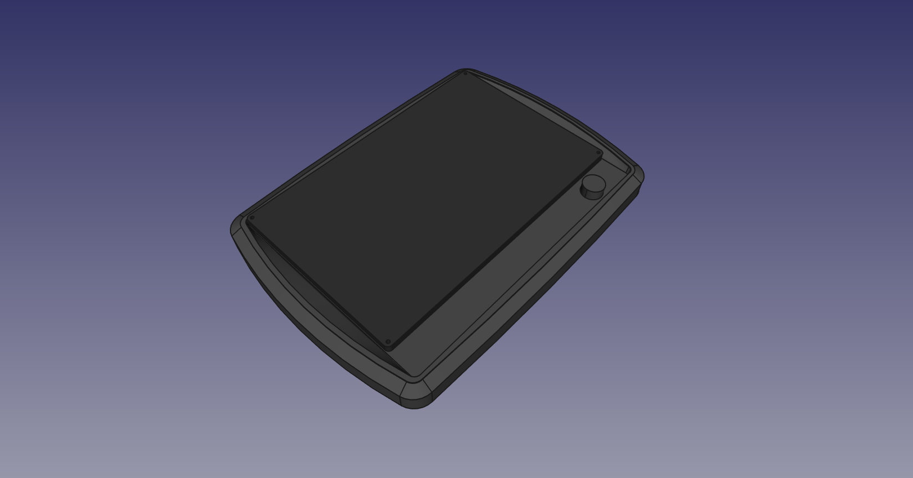
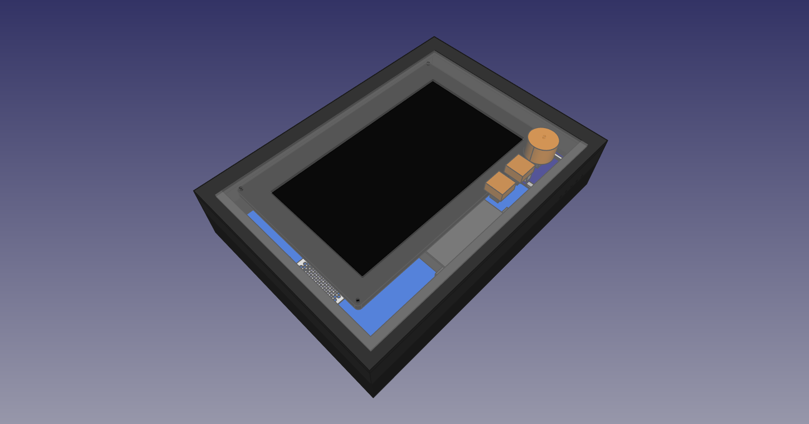
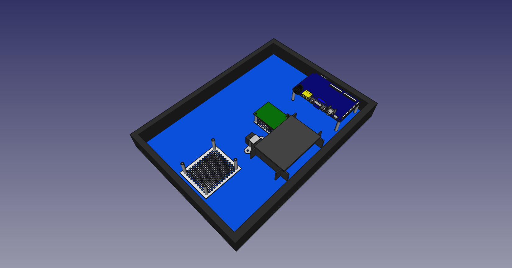

# Hardware

## Table of content

- [1. Power board spice simulation](#1-power-board-spice-simulation)
- [2. Power board schematic](#2-power-board-schematic)
- [3. CAD case design](#3-cad-case-design)
  - [3.1 Preparation](#31-preparation)
  - [3.2 Dimensions for the parts in the design](#32-dimensions-for-the-parts-in-the-design)
  - [3.3 Case prototypes](#33-case-prototypes)

## 1. Power board spice simulation

&#8594; directory: simulation

The power board should grand power to the Pi as long as it boots and until a feedback signal has been asserted. The power should be cut a short time after the feedback signal has been deasserted. 

The base design is heavily inspired by an [existing version of the power circuity](http://www.netzmafia.de/skripten/hardware/RasPi/Projekt-OnOff/index.html).

The final design has been simulated in [LTSpice](http://www.analog.com/en/design-center/design-tools-and-calculators/ltspice-simulator.html).

## 2. Power board schematic

&#8594; directory: schematic

Additional features for this specific power board are:

1. A 12V to 5V DC/DC conversion to power the whole system from 1 power supply
2. Polarity protection for the barrel plug in case a wrong power supply is used
3. A way to provide efficient power cutting without leakage current

The features were implemented in the following way

1. A switching converter for maximum efficiency
2. [Protection via a MOSFET](http://www.ti.com/lit/an/slva139/slva139.pdf) because a series diode would cause a voltage drop and a parallel diode would need a fuse
3. A 5V relay with an RC element, that keeps the switching current and reduces the hold current

## 3. CAD case design

&#8594; directory: CAD

### 3.1 Preparation

Software: [FreeCAD](https://www.freecadweb.org/wiki/Download)

In order to design a case, one should get hold of one of the various
Raspberry Pi 3 CAD designs from the web. For example from:

* [GrabCAD (personal, noncommercial use only)](https://grabcad.com/)
* [Thingiverse (creative common licenses)](https://www.thingiverse.com/)

All the other designs can be found in the folder CAD.
A Raspberry Pi 3 design can also be created by oneself using the schematics
from [the Rasperry Pi documentation](https://www.raspberrypi.org/documentation/hardware/raspberrypi/mechanical/README.md).

### 3.2 Dimensions for the parts in the design

* [LCD screen](https://www.waveshare.com/img/devkit/LCD/10.1inch-HDMI-LCD-with-Holder/10.1inch-HDMI-LCD-with-Holder-size.jpg)
* [LCD controller board](http://www.waveshare.com/w/upload/5/51/10.1inch-hdmi-lcd-control-board-dimension.jpg)
* [Lock switch front](https://docs-emea.rs-online.com/webdocs/0eff/0900766b80eff837.pdf) and [back](http://www.produktinfo.conrad.com/datenblaetter/750000-774999/753963-da-01-de-Schluesselschalter_Gesamtlaenge_47mm.pdf)
* Power board &#8594; see the *.brd*-file in the *schematic* directory

### 3.3 Case prototypes

  
**[Premade case for an exposed touchscreen kiosk from RND](https://www.distrelec.de/Web/Downloads/_t/ds/RND_455-00355_30064576_mcd_eng_tds.pdf)**

  
  
**2 IKEA Ribba 21x30 mounted back to back for a protected button kiosk**